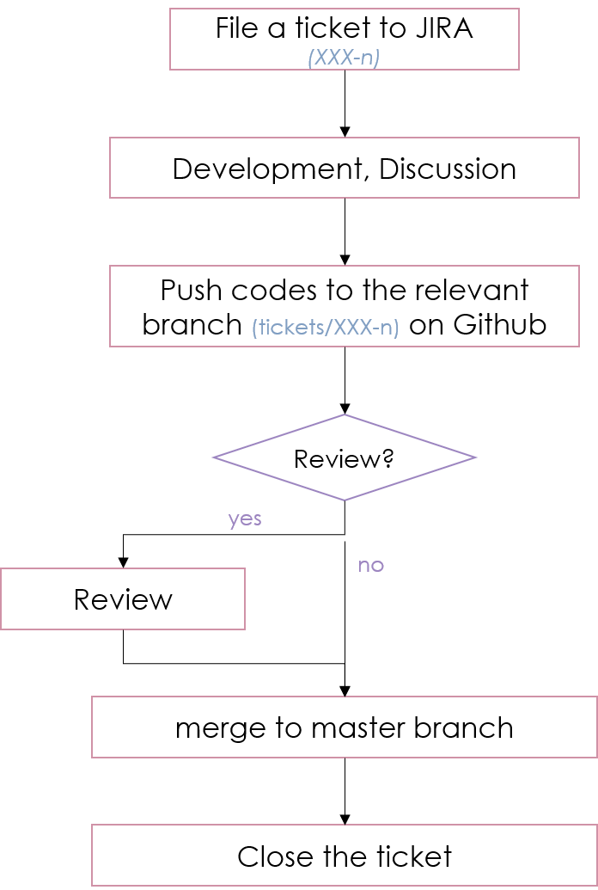

PFS Software Developement Practice
==================================
This document describes common rules and guidelines for developing the PFS software.

.. contents:: Table of Contents
.. section-numbering::

Developement Infrastructure
---------------------------
Code Repositories
^^^^^^^^^^^^^^^^^

All codes for PFS software packages should be available on the `Github <https://github.com>`_ repositories hosted by `Subaru-PFS <https://github.com/Subaru-PFS>`_ organization.
The available repositories are listed in `Subaru-PFS Github page <https://github.com/Subaru-PFS>`_ and `the PFS official web site <https://pfspipe.ipmu.jp/repos.html>`_.
If the developer needs to create a new repository, he/she shoud send request to the adiministrators of the PFS Project Office, following `the procedure <request.rst>`_ ("Add new GitHub repository" section).

JIRA
^^^^

`JIRA <https://pfspipe.ipmu.jp/jira/>`_ is used for tracking development work and discussion.

Developement Workflow
---------------------
`Figure 1 <fig-wg>`_ shows the workflow of the PFS software development, based on the LSST project ([Ref2]_).

    **Figure 1:** Work flow

All works shall be ticketed to `JIRA <https://pfspipe.ipmu.jp/jira/>`_ before they are undertaken.
The developer should file his/her (or colleague's) ticket to a proper project among `the existing ones <https://pfspipe.ipmu.jp/jira/secure/BrowseProjects.jspa?selectedCategory=all&selectedProjectType=all>`_. 
If there is no proper project, send request to the adiministrators of the PFS Project Office, following `the procedure <request.rst>`_ ("Add new JIRA project" section).
Here are a few items to pay attention to when filing a ticket, citing from ([Ref1]_.).

    The summary and description fields are the most important; provide as much information as possible in the description field such that an assigned developer can address the issue quickly, and provide a meaningful summary such that the issue can be easily identified on a board or query output.

    With regards to issue types, we do not make semantic distinctions between "story" and "task", both of which reflect a new item of work that needs to be addressed, but “bug” should be used when a problem is found in an existing version of a given piece of code.

    Sometimes issues need to be grouped into particular categories in order to more easily identify groups of work, such as "2D PSF modelling" or "arm merging". For this purpose, the "label" field can be used. Regarding other exotic fields, the "component" field is typically used for categories that exist in the long term, but has it’s own limitations in that it is project-specific. In general, as labels are more flexible it is not recommended to use this. For short-term work, the developer may use the "epic" field, as it does have the advantage that JIRA highlights issues associated to a given epic in scrum boards, but it also has a significant limitation in that only one epic can be assigned to one ticket. Because of that, this field will not be used for general project scheduling.

Filed ticket is named ``XXX-n``, where ``XXX`` is the key of the project (``DAMD`` for the Data Model project, for instance), and ``n`` is the ID number of the ticket. The status is *Open* in general at this point.

Once the assignee starts working on the ticket, he/she should change JIRA status to *In Progress*.
The code developement and modification shoud be undertaken in the branch named after the ticket (e.g. ``tickets/XXX-n`` for the ticket ``XXX-n``) in relating repositories, **not in the master branch**.

The assignee should test the codes well before setting Pull Request.
When finishing testing the code, the developer should set a Pull Request, assign the reviewer(s), and change the JIRA status to *In Review*. 
Here, he/she should add a comment how the test has been done, what are the outputs, and why the outputs are convincing to adress the issue on the ticket. 
It is reccomemded to notify the reviewer.
Note that the manager (or equivalent colleague) may change the reviewer(s) considering the workload balance and priority at that time.

If there is reason for which a review is not necessary or impractical (e.g., a simple typo in documentation, or a review will take too long), then the developer can contact the manager to ask to either not have a review, or cancel the review.

When the reviewer approves the code, or if the manager agrees to merging the ticket branch to master without review, the developers merges the branch to master, and changes the JIRA ticket status to *Close*.
Informative comment on the tests and results to be added, if they have not been adressed well in the earlier processes.

Exceptions
^^^^^^^^^^

All development work should be done in the branch-and-review process, as described above.
However, there is a case where this workflow is not applicable.

PFS have a few repositories (codes and documents) where one developer (or two) is allowed as a custodian to take care of completely, such as reference code registries and the abbreviations list. 
He/she can change such files without following branch-and-review workflow.

Here is a list to these files:

+-------------+------------------------------+-----------------+
| Repository  | File                         | Custodian(s)    |
+=============+==============================+=================+
| doc         | misc/PFS_Abbreviations.tsv   | Hassan Siddiqui |
|             |                              | / Yuki Moritani |
+-------------+------------------------------+-----------------+
| doc         | registries/princeton         | Hassan Siddiqui |
+-------------+------------------------------+-----------------+
| doc         | registries/mitaka            | Masayuki Tanaka |
+-------------+------------------------------+-----------------+
| doc         | registries/ipmu              | Yuki Moritani   |
+-------------+------------------------------+-----------------+

If finding something to modify the above files, the developer should contact to the custodian.

System-level (L2) requirements relating with PFS software developement
----------------------------------------------------------------------

(Note that there are L3 and L4 requirements for software packages.)

Below listed are a couple of the most important requirements for software developments.

Coding Standars
^^^^^^^^^^^^^^^

`RES-SYS-1103 <https://sumire.pbworks.com/w/page/76623143/REQ%20SYS%201103>`_ describes the requirement of the comutar language used for the PFS project:

    Source codes of PFS software modules shall be written in major languages like those considered as industry standard.

Documentation
^^^^^^^^^^^^^

`REQ SYS 458 <https://sumire.pbworks.com/w/page/76623227/REQ%20SYS%20458>`_ describes the requirement of documentations:

    PFS shall provide the Subaru observation and NAOJ with all documents and manuals necessary for instrument operation and maintenance work at the time of instrument hand-over after the instrument commissioning completes and science operation starts. All documents shall be written in English.

References
----------

.. [Ref1] *"2D DRP Development Practices"*, The PFS 2D Pipeline Team
.. [Ref2] *"LSST DM Developer Guide"*, The LSST Project (https://developer.lsst.io/)