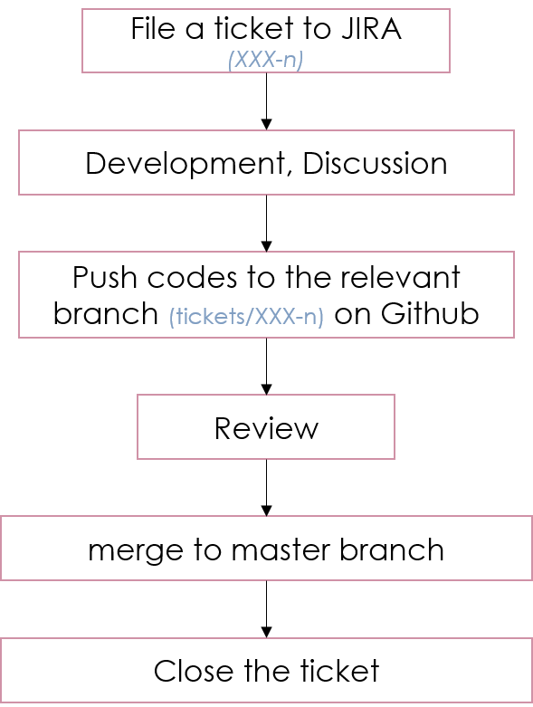

PFS Software Developement Practice
==================================

Developement Infrastructure
---------------------------
Code Repositories
^^^^^^^^^^^^^^^^^

The all codes for PFS software packages should be available on the `Github <https://github.com>`_ repositories hosteed by `Subaru-PFS <https://github.com/Subaru-PFS>`_ organization.
If you need to create a new repository, you shoud send request to the adiministrator of the PFS Project Office, following `the procedure <request.rst>`_ ("Add new GitHub repository" section).

JIRA
^^^^

`JIRA <https://pfspipe.ipmu.jp/jira/>`_ is used for track of development work and discussion.

Developement Workflow
---------------------

The above figure shows the workflow of the PFS software development, based on the LSST project.

All works shall be ticketed to `JIRA <https://pfspipe.ipmu.jp/jira/>`_ before they are undertaken.
File your (or colleague's) ticket to a proper project among `the existing ones <https://pfspipe.ipmu.jp/jira/secure/BrowseProjects.jspa?selectedCategory=all&selectedProjectType=all>`_. 
If there is no proper project, send request to the adiministrator of the PFS Project Office, following `the procedure <request.rst>`_ ("Add new JIRA project" section).
Here is a few items to take care when filing a ticket, citing from (Ref 1.).
    The summary and description fields are the most important; provide as much information as possible in the description field such that an assigned developer can address the issue quickly, and provide a meaningful summary such that the issue can be easily identified on a board or query output.

    With regards to issue types, we do not make semantic distinctions between "story" and "task", both of which reflect a new item of work that needs to be addressed, but “bug” should be used when a problem is found in an existing version of a given piece of code.

    Sometimes issues need to be grouped into particular categories in order to more easily identify groups of work, such as "2D PSF modelling" or "arm merging". For this purpose, the "label" field can be used. Regarding other exotic fields, the "component" field is typically used for categories that exist in the long term, but has it’s own limitations in that it is project-specific. In general, as labels are more flexible it is not recommended to use this. For short-term work, the developer may use the "epic" field, as it does have the advantage that JIRA highlights issues associated to a given epic in scrum boards, but it also has a significant limitation in that only one epic can be assigned to one ticket. Because of that, this field will not be used for general project scheduling.

Filed ticket is named `XXX-n`, where `XXX` is the key of the project (DAMD for the Data Model project),
and `n` is the ID of the ticket. The status is *Open* in general at this point.

Once the assignee starts working on the ticket, change JIRA status to *In Progress*.
The code modification, developement shoud be undertaken in the branch named after the ticket (e.g. tickets/XXX-n for the ticket "XXX-n") in relating repositories (**not master branch**).

Test the code well before Pull Request for review and/or merge.
The manager and/or relevant colleague for each project decide whether the review is needed for the ticket.
If the review is needed, chenge the JIRA status to *In Review* and notify it the reviewer.

.. note::

    In what timing he/she decide and notice it?

When the reviewer approved the code, or the review is not required, merge the branch to master.

When work is done, change the status to *Close*.

.. note::

    Who should have this process?

System-level (L2) requirements relating with PFS software
---------------------------------------------------------

(Note that there are L3 and L4 requirements for software packages.)

Below listed are a couple of the most important requirements for developments.

Coding Standars
^^^^^^^^^^^^^^^

`RES-SYS-1103 <https://sumire.pbworks.com/w/page/76623143/REQ%20SYS%201103>`_ describes the requirement of the comutar language used for the PFS project.

Documentation
^^^^^^^^^^^^^

References
----------
1. *"2D DRP Development Practices"*, The PFS 2D Pipeline Team